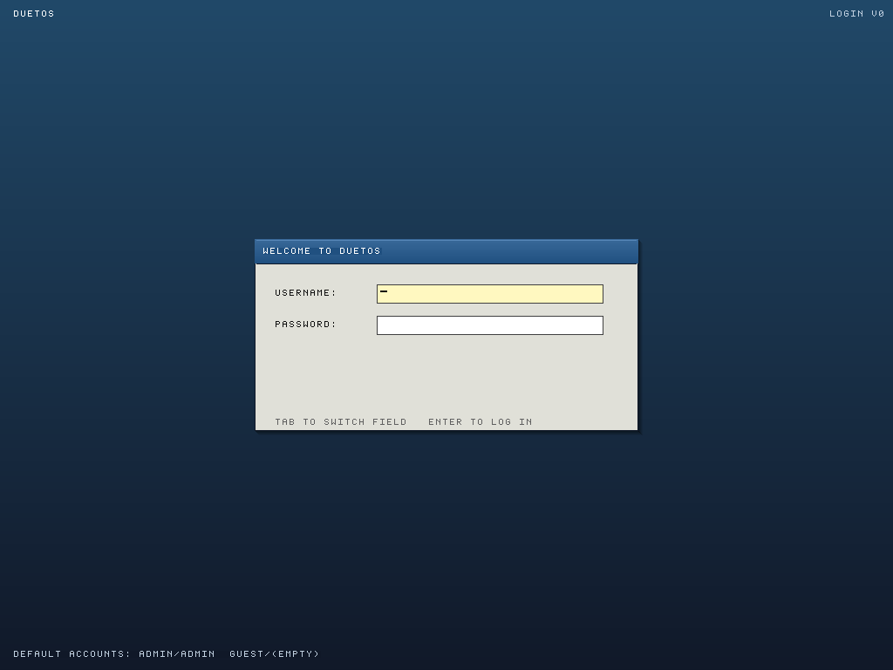
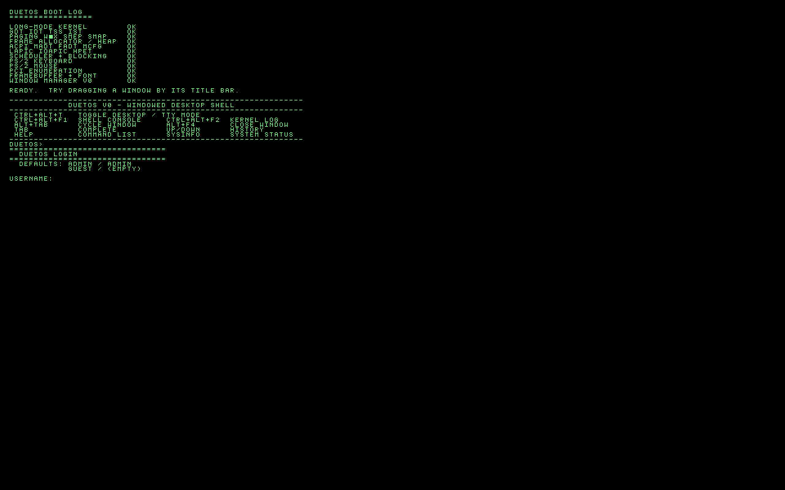
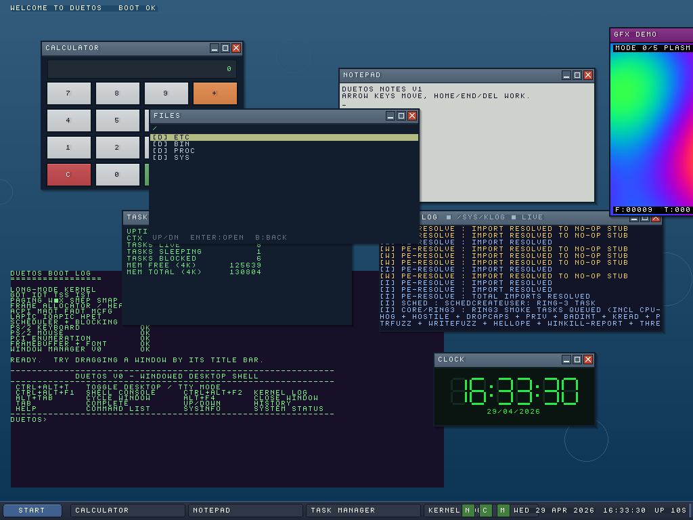
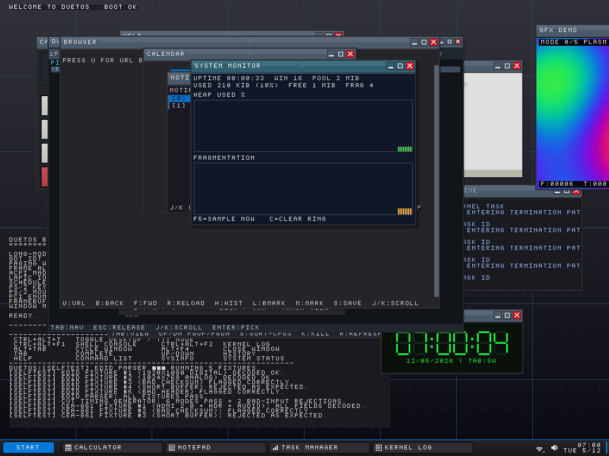
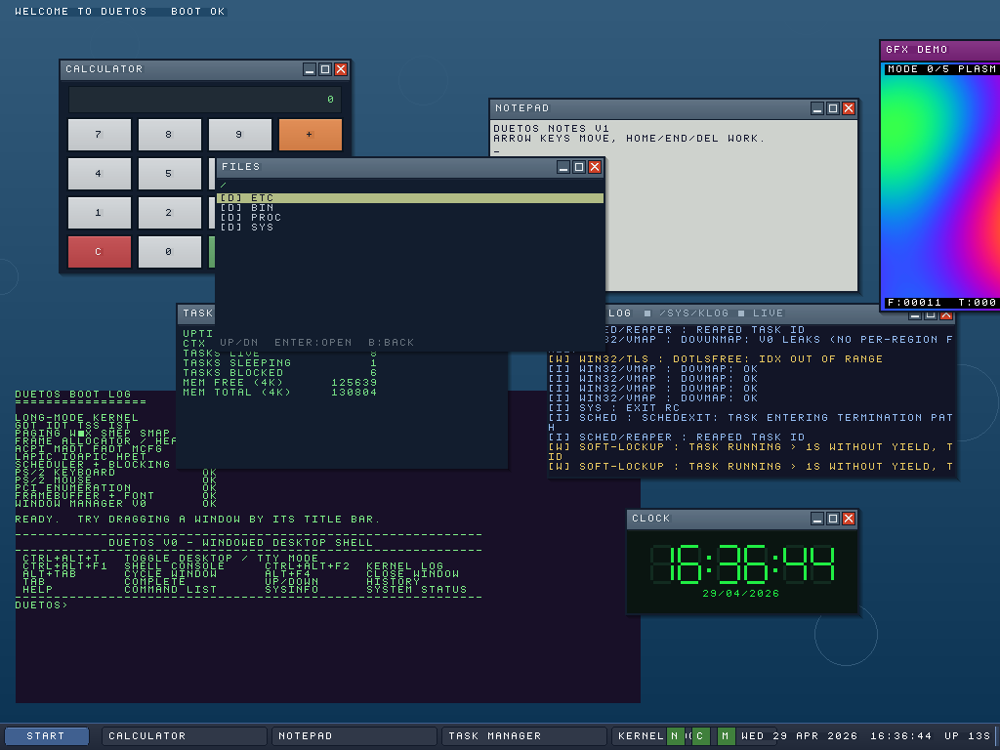
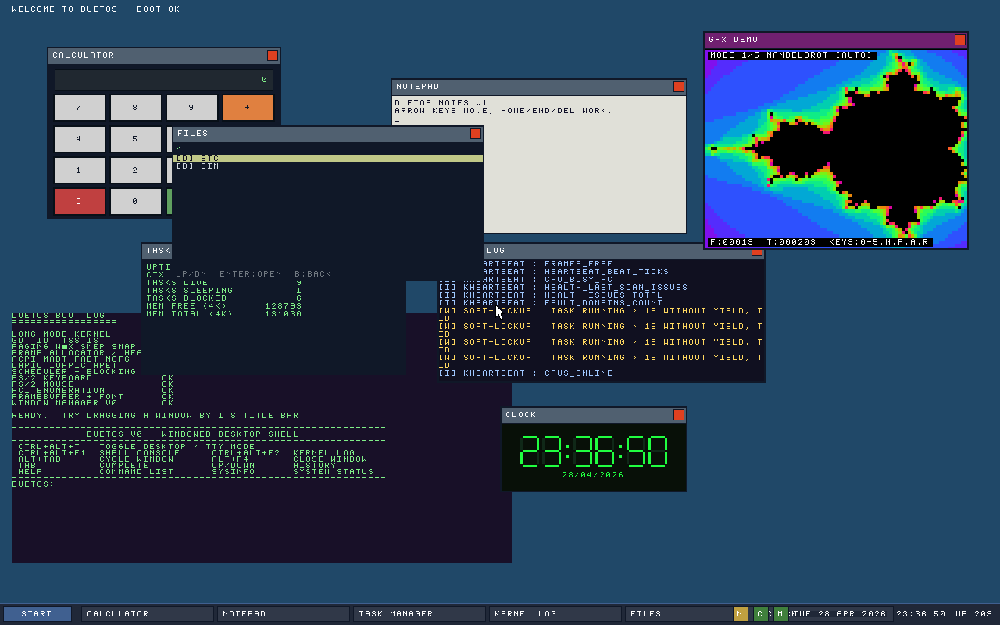

# DuetOS

[](https://github.com/DuetOS/DuetOS/releases/latest/download/duetos.iso)

Download the latest bootable ISO: **[duetos.iso](https://github.com/DuetOS/DuetOS/releases/latest/download/duetos.iso)**.

A general-purpose operating system, written from scratch, that runs
Windows PE executables natively — not via a VM, not via Wine, not as an
emulator bolted onto another host OS. The PE loader, the NT syscall
surface, the full set of user-mode DLLs (`kernel32`, `ntdll`, `user32`,
`gdi32`, `ucrtbase`, `msvcp140`, …) all live in this repo, co-equal with
the native ABI.

Currently runs x86_64. UEFI boot on commodity hardware. 33 slices of
development and one live-verified fact:

```
Windows Kill 1.1.4 | Windows Kill Library 3.1.3
Not enough argument. Use -h for help.
```

That's a real MSVC-built third-party Windows PE printing to our serial
console after going through our PE loader, our 29 userland DLLs, our
scheduler, and our syscalls. Bits as shipped, running on DuetOS.

---

## What's here

- **Kernel** (`kernel/`) — Multiboot2 boot, 4-level paging, per-process
  address spaces, SMP-aware round-robin scheduler, W^X + SMEP/SMAP +
  ASLR + stack canaries + retpoline, capability-based IPC,
  `int 0x80` native syscall ABI (~57 numbered calls). PCIe, NVMe,
  AHCI, xHCI/USB, PS/2, HDA, e1000. HPET-calibrated LAPIC timer.
  Kernel-mode breakpoint subsystem with hardware DR gates. Live crash
  dump with inline symbol resolution.
- **PE loader** (`kernel/core/pe_loader.cpp`, `pe_exports.cpp`,
  `dll_loader.cpp`) — validates DOS + NT + PE32+ headers, maps
  sections with characteristic-driven flags, applies DIR64 base
  relocations, walks the Export Address Table, resolves imports
  against preloaded DLLs with forwarder chasing, falls through to a
  legacy stubs path for anything not yet ported.
- **Win32 translator DLLs** (`userland/libs/`) — 29 userland DLLs
  totalling ~760 exports. `kernel32` (155), `ntdll` (114), `ucrtbase`
  (72), `user32` (73), `gdi32` (44), `kernelbase` (44 forwarders),
  plus `msvcrt`, `msvcp140`, `vcruntime140`, `dbghelp`, `advapi32`,
  `shell32`, `shlwapi`, `ole32`, `oleaut32`, `winmm`, `bcrypt`,
  `psapi`, `crypt32`, `comctl32`, `comdlg32`, `version`, `setupapi`,
  `iphlpapi`, `userenv`, `wtsapi32`, `dwmapi`, `uxtheme`, `secur32`,
  `ws2_32`, `wininet`, `winhttp`, `d3d9`/`11`/`12`, `dxgi`.
- **Real implementations** — registry, `fopen`/`fread`/`fseek`/`fgets`,
  `printf` formatting, `getenv`, heap (`malloc`/`HeapAlloc`), atomics,
  critical sections, SRW locks, InitOnce, time, threads, mutexes,
  events, semaphores, TLS slots.
- **Inspect tooling** (`kernel/debug/inspect.h`) — shell-driven
  disassembly and reverse-engineering surface that predates the PE
  loader. First-byte opcode histograms, syscall-site recovery, spawn-
  time image scanning.

---

## The layering, in one diagram

```
Windows PE applications
        ↓ imports
Win32 translator DLLs  (userland/libs/, 29 DLLs)
        ↓ int 0x80
Native DuetOS kernel
        ↓
Kernel-mode drivers (PCIe, NVMe, AHCI, USB, NIC, GPU, audio, input)
```

The Win32 DLLs are **translators**, not parallel subsystems. There is
one TCP stack in the kernel, one compositor, one VFS, one registry —
each reachable from two entry ABIs (native and Win32). See
[`docs/ARCHITECTURE.md`](docs/ARCHITECTURE.md) for the full picture,
including how `ws2_32!send` reaches the e1000 transmit ring.

---

## Build + run

```bash
# Configure (x86_64-debug or x86_64-release)
cmake --preset x86_64-debug

# Build kernel + all userland DLLs + ISO
cmake --build build/x86_64-debug --parallel $(nproc)

# Boot in QEMU — watches the serial log on stdout
DUETOS_TIMEOUT=30 tools/qemu/run.sh build/x86_64-debug/duetos.iso
```

Tools required for the ISO path:
`qemu-system-x86`, `ovmf`, `grub-common`, `grub-pc-bin`,
`grub-efi-amd64-bin`, `xorriso`, `mtools`. Compiler baseline:
Clang 18+ (used as both the freestanding kernel compiler and the
host cross-compiler for the userland Windows PE toolchain).

A healthy boot ends with something like:

```
[ring3] registered 0x26 DLL(s) pid=0x13
[reg-fopen-test] ProductName="DuetOS" (type=1, size=7)
[reg-fopen-test] /bin/hello.exe first two bytes: 0x4d 0x5a
[reg-fopen-test] all checks passed
Windows Kill 1.1.4 | Windows Kill Library 3.1.3
Not enough argument. Use -h for help.
[I] sys : exit rc val=0x1234
```

---

## Screenshots

Captured live from the QEMU runs that produce the boot log above. See
[`docs/screenshots/`](docs/screenshots/) for the PNGs. Reproduce any of
them with:

```bash
cmake --preset x86_64-debug
cmake --build build/x86_64-debug --parallel $(nproc)

# Full framebuffer PNG of the default boot (login gate)
tools/qemu/screenshot.sh docs/screenshots/01-login-screen.png

# Other boot entries by index-from-default (see boot/grub/grub.cfg)
tools/qemu/screenshot-theme.sh 5 docs/screenshots/02-desktop-classic.png
tools/qemu/screenshot-theme.sh 6 docs/screenshots/03-desktop-slate10.png
tools/qemu/screenshot-theme.sh 2 docs/screenshots/04-terminal-tty.png

# Native pixel-render demo (longer settle so the gfxdemo window paints fully)
DUETOS_SETTLE=20 tools/qemu/screenshot-theme.sh 5 docs/screenshots/08-gfxdemo-pixel-render.png
```

| Login gate | Terminal (TTY) |
|------------|----------------|
|  |  |
| Default boot. USERNAME/PASSWORD form, default accounts hinted at the bottom. | `boot=tty` entry. Fullscreen green-on-black framebuffer console with the boot log, shell help, and login prompt. |

| Windowed desktop, Classic theme | Windowed desktop, Slate10 theme |
|---------------------------------|---------------------------------|
|  |  |
| Calculator, Notepad, Files, Task Manager, Kernel Log, Clock widget, taskbar with Start button + pinned apps + tray + clock. | Same compose, Slate10 theme — dark charcoal chrome, flat Win10-blue accent. `Ctrl+Alt+Y` cycles themes at runtime. |

### Native pixel rendering — gfxdemo + DirectX v0 path



The **GFX DEMO** window in the upper right is a native DuetOS app
(`kernel/apps/gfxdemo.cpp`) whose content-draw callback computes
**every pixel** of its client area on each compose: a diagonal
RGB gradient (red on the X axis, green on the Y, blue on the
anti-diagonal) with a soft 16-pixel quilt shimmer, three concentric
outline rings traced by an integer sine LUT (white / cyan / magenta),
and a yellow sine-wave overlay across the mid-Y row. Two centred 8x8
text strips identify the path. Same compose, same compositor, same
SYS_GDI_BITBLT pipeline as the Calculator / Notepad / Files / Task
Manager / Kernel Log / Clock / WINDOWED HELLO windows around it —
just with the client filled by computed pixels rather than glyphs
or chrome fills.

The same `FramebufferPutPixel` / `FramebufferFillRect` / `FillRgba`
primitive set is what the DirectX v0 DLLs (`d3d9` / `d3d11` /
`d3d12` / `dxgi`) call into when an MSVC PE goes
`D3D11CreateDeviceAndSwapChain → ClearRenderTargetView → Present`.
See [`.claude/knowledge/directx-v0.md`](.claude/knowledge/directx-v0.md)
for the COM-vtable layout and the Clear-and-Present plumbing.

### Windows PE on the serial console

[`docs/screenshots/06-windows-pe-serial-excerpt.txt`](docs/screenshots/06-windows-pe-serial-excerpt.txt)
is the live excerpt for the PE-on-DuetOS evidence block: an MSVC-built
fixture queries the registry (`ProductName="DuetOS"`, 7 bytes), `fopen`s
`/bin/hello.exe` and reads `MZ`, then `windows-kill.exe` — a real
third-party 80 KB PE with 52 imports across 6 DLLs — prints its
signature line and exits cleanly through our Win32 DLL surface.

### Windowed PE through user32!CreateWindowExA



`/bin/windowed_hello.exe` (see [`userland/apps/windowed_hello/`](userland/apps/windowed_hello/))
is a real Windows PE that imports `CreateWindowExA`, `ShowWindow`, and
`MessageBoxA` from `user32.dll` plus `Sleep` and `ExitProcess` from
`kernel32.dll`. On boot, the PE loader maps it, the import resolver
binds each call against the preloaded `user32.dll`'s EAT, and the stub
issues `int 0x80` with `SYS_WIN_CREATE` (58) / `SYS_WIN_SHOW` (60) /
`SYS_WIN_MSGBOX` (61). The kernel-side handlers route into the
compositor in `kernel/drivers/video/widget.cpp` — the blue-titled
**WINDOWED HELLO** window bottom-right in the screenshot is the result,
painted in the same pass as the native Calculator / Notepad / Files /
Task Manager / Kernel Log windows. Serial log excerpt for the same
run:

```
[msgbox] pid=0x16 caption="Windowed Hello" text="Running on DuetOS!"
[win] create pid=0x16 hwnd=7 rect=(500,400 420x220) title="WINDOWED HELLO"
[I] sys : exit rc val=0x57
```

Reproduce with:

```bash
DUETOS_SETTLE=10 tools/qemu/screenshot-theme.sh 5 docs/screenshots/07-windowed-hello.png
```

---

## What works today

Freestanding Win32 PEs (no CRT, direct `int 0x80`) — since early
development. Console programs with CRT, threads, mutexes, events,
atomics, `printf`, file I/O, registry queries — current. Real
third-party Windows binary (`windows-kill.exe`) — running end-to-end
through the DLL surface.

## What doesn't work (yet)

Windowing v0 landed (see screenshot above): `user32!CreateWindowExA/W`,
`ShowWindow`, `DestroyWindow`, and `MessageBoxA/W` are now bridged to
the in-kernel compositor (`kMaxWindows` = 16, four new syscalls in
the 58..61 range). Still missing on the windowing track: GDI paint
APIs (`BitBlt` / `TextOut` / `Rectangle` are still silent no-ops —
the window chrome paints but the client area stays blank), per-window
message queues (`GetMessage` / `PeekMessage` still return WM_QUIT so
event-driven programs exit their pump immediately), and
keyboard/mouse routing to the target window (input still goes to the
native console).

Networking — `ws2_32!socket` returns `INVALID_SOCKET`; the kernel
net stack is a skeleton. DirectX v0 — `D3D11CreateDeviceAndSwapChain`,
`IDXGIFactory*::CreateSwapChain*`, `D3D12CreateDevice`,
`Direct3DCreate9` all hand out real COM objects with vtables;
`ClearRenderTargetView` fills a BGRA8 back buffer in user-mode
memory and `Present` BitBlts it to the owning HWND via
`SYS_GDI_BITBLT`. Higher-level drawing (vertex/pixel shaders,
real `Draw*` calls, fence-driven GPU sync, cross-DLL DXGI ↔ D3D11/12
swap-chain marriage) is `E_NOTIMPL`. No Vulkan ICD yet. COM —
returns `CLASS_E_CLASSNOTAVAILABLE`. Each of those is its own
multi-slice implementation track; the DLL surface is the
scaffolding that makes them possible.

See [`docs/HISTORY.md`](docs/HISTORY.md) for how the project got to
this point and [`docs/ARCHITECTURE.md`](docs/ARCHITECTURE.md) for the
current layering model. [`CLAUDE.md`](CLAUDE.md) is the authoritative
development guide — coding standards, anti-bloat guidelines, and the
full architectural statement.

---

## Non-goals

- **Not a Linux distribution, and not a Linux host.** There is no Linux
  kernel under this tree. The kernel in `kernel/` is written from
  scratch and booted directly by GRUB/UEFI into long mode; nothing
  else runs below it. `subsystems/linux/` is a **guest ABI translator**
  — the same shape as `subsystems/win32/`, a second entry ABI into our
  kernel, so a Linux ELF binary can call `syscall` and hit a DuetOS
  syscall via the translation unit. Win32 and Linux are peers; the
  host is DuetOS.
- Not a Wine fork. Wine is useful prior art; this repo does not vendor
  it or link against it.
- Not a ReactOS rewrite.
- Not a research microkernel. Pragmatism over academic purity.
- Not aiming at binary compatibility with specific Windows DLL
  versions — we aim at *executable* compatibility (run the `.exe`).

---

## Layout

```
boot/          UEFI loader + boot protocol
kernel/
  arch/x86_64/ bootstrap, paging, GDT/IDT, traps, APIC, context switch
  core/        entry, pe_loader, dll_loader, scheduler helpers, syscalls
  debug/       breakpoints, inspect, syscall-site scanner
  drivers/     pci, storage/, usb/, net/, gpu/, audio/, input/, video/
  fs/          VFS, ramfs, FAT32, NTFS (read-only), GPT
  mm/          frame allocator, paging, kheap, kstack, address_space
  net/         protocol stacks (skeleton)
  sched/       scheduler + blocking primitives
  security/    guards, pentest probes
  subsystems/
    graphics/  compositor + Vulkan ICD (skeleton)
    linux/     Linux-ABI syscall bridge
    translation/ NT → Linux syscall translator
    win32/     flat-stubs page (legacy fallback), syscall handlers
  sync/        spinlock, waitqueue primitives
userland/
  apps/        test fixtures (hello_pe, hello_winapi, windows-kill,
               thread_stress, syscall_stress, customdll_test,
               reg_fopen_test, …)
  libs/        29 userland DLLs shipped into every Win32-imports PE
tools/         build helpers, QEMU launcher, embed-blob, gen-symbols
docs/          architecture, history, ABI matrix, design notes
tests/         hosted + on-target tests
.claude/       working notes kept from development
```

---

## License

See [`LICENSE`](LICENSE).
