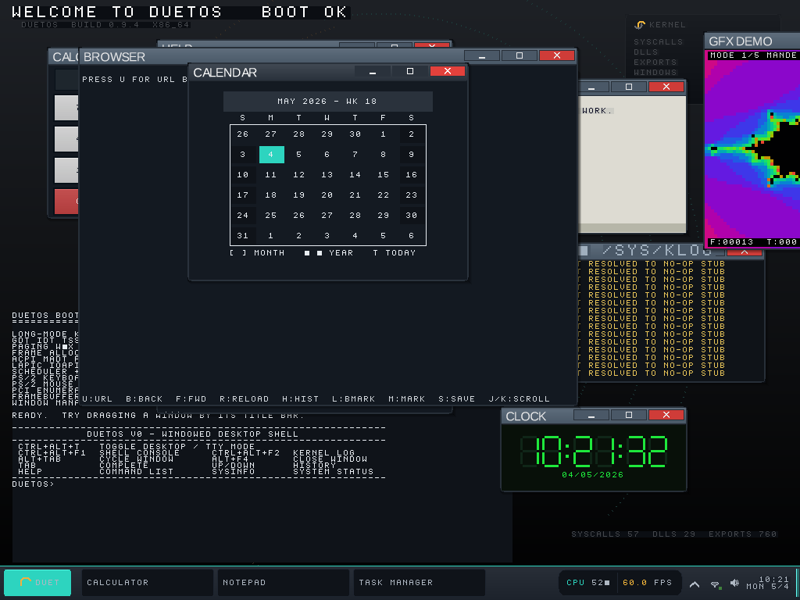

# DuetOS

[](https://deepwiki.com/krilliac/duetos)

**A from-scratch operating system that boots on real PC hardware and runs Windows `.exe` files natively** — not under a VM, not through Wine, not as an emulator on top of Linux. The PE loader, the NT syscall layer, and 44 reimplemented Win32 DLLs (`kernel32`, `ntdll`, `user32`, `gdi32`, `ucrtbase`, `msvcp140`, `d3d11`, …) live in this repo as a peer ABI alongside the native one.



Everything in that screenshot is painted in a single compose pass by our kernel-side compositor:

- **Calculator, Notepad, Files, Task Manager, Kernel Log, Clock** — native DuetOS apps.
- **GFX Demo** (top right) — a native app computing every pixel in its client area on every frame; the same `FramebufferPutPixel` / `FramebufferFillRect` primitive set our `d3d11` / `d3d12` / `dxgi` DLLs call into when a Windows PE goes `D3D11CreateDeviceAndSwapChain → ClearRenderTargetView → Present`.
- **System Monitor** — live heap usage, fragmentation, syscalls/sec, FPS, window count — taken straight from kernel counters.
- **Taskbar** — Start menu, pinned apps, tray, clock, Duet theme. `Ctrl+Alt+Y` hot-swaps to Classic / Slate10 / Amber. `theme=<name>` on the kernel cmdline picks one at boot.

---

## Running real Windows binaries

```
[reg-fopen-test] ProductName="DuetOS" (type=1, size=7)
[reg-fopen-test] /bin/hello.exe first two bytes: 0x4d 0x5a
[reg-fopen-test] all checks passed
Windows Kill 1.1.4 | Windows Kill Library 3.1.3
Not enough argument. Use -h for help.
[I] sys : exit rc val=0x1234
```

The "Windows Kill" line is **not ours**. It's `windows-kill.exe` — a third-party 80 KB MSVC-built PE with **52 imports across 6 DLLs**, downloaded as-shipped from its release page. Our PE loader maps it, our import resolver binds every call against the preloaded DLLs' export tables, and the program runs to a clean exit through our `ucrtbase` / `kernel32` / `ntdll` / `advapi32` surface. No source patches, no relinking, no recompile.

Windows binaries that open windows work too. `/bin/windowed_hello.exe` imports `CreateWindowExA`, `ShowWindow`, and `MessageBoxA` from our `user32.dll`, then issues `int 0x80` with `SYS_WIN_CREATE` (58) / `SYS_WIN_SHOW` (60) / `SYS_WIN_MSGBOX` (61); the kernel handlers land a real window in the compositor next to Calculator and Notepad. See [`docs/screenshots/07-windowed-hello.png`](docs/screenshots/07-windowed-hello.png).

---

## How it fits together

```
Windows PE applications
        ↓ imports
44 Win32 translator DLLs  (userland/libs/, ~1100 exports total)
        ↓ int 0x80
DuetOS kernel  (one VFS, one TCP stack, one compositor, one registry)
        ↓
Kernel-mode drivers  (PCIe, NVMe, AHCI, xHCI/USB, e1000, HDA, GPU)
```

The Win32 DLLs are **translators**, not a parallel subsystem. A native DuetOS app and a Windows PE both make the same syscalls to the same kernel, walk the same address-space tables, and paint into the same compositor. There is no second TCP stack, no shadow VFS, no parallel registry. Subsystem isolation rules and the audit checklist live in [`wiki/kernel/Subsystem-Isolation.md`](wiki/kernel/Subsystem-Isolation.md).

Kernel: UEFI boot on x86_64, 4-level paging, SMP-aware scheduler, W^X + SMEP/SMAP + ASLR + stack canaries + retpoline, capability-based IPC, ~190 numbered syscalls. PCIe enumeration, NVMe, AHCI, xHCI/USB, PS/2, Intel HDA, e1000 NIC. HPET-calibrated LAPIC timer. Kernel-mode breakpoint subsystem with hardware DR gates. Live crash dump with inline symbol resolution.

No Linux kernel under this tree, no GNU userland, no Wine vendoring, no ReactOS fork. The kernel is written from scratch and booted directly by GRUB/UEFI into long mode.

---

## Try it

**Pre-built ISO** — boot in QEMU in 30 seconds, no toolchain needed:

```bash
wget https://github.com/krilliac/duetos/releases/download/latest-release/duetos-release.iso
qemu-system-x86_64 -bios /usr/share/ovmf/OVMF.fd -cdrom duetos-release.iso -serial stdio
```

**From source** — clone, configure, build, boot:

```bash
git clone https://github.com/krilliac/duetos.git && cd duetos
cmake --preset x86_64-debug
cmake --build build/x86_64-debug --parallel $(nproc)
DUETOS_TIMEOUT=30 tools/qemu/run.sh build/x86_64-debug/duetos.iso
```

Toolchain: Clang 18+, CMake 3.25+, NASM 2.16+. ISO build needs `qemu-system-x86`, `ovmf`, `grub-common`, `grub-pc-bin`, `grub-efi-amd64-bin`, `xorriso`, `mtools`. Build flavors (release-asserts for paranoid production, release-audit for forensic capture, release-lto, debug-ubsan, debug-fast) are documented in [`wiki/tooling/Build-System.md`](wiki/tooling/Build-System.md).

---

## What works · what doesn't (yet)

| Working today | Skeleton / not yet |
|---|---|
| Freestanding PEs (no CRT, direct `int 0x80`) | `ws2_32!socket` returns `INVALID_SOCKET` — kernel net stack is a skeleton |
| Console PEs with CRT — threads, mutexes, events, atomics, `printf`, file I/O | GDI paint APIs — chrome paints, client area stays blank |
| Registry queries against a real Win32-shaped hive | Per-window message queues — `GetMessage` returns `WM_QUIT` so pumps exit immediately |
| Windowing — `CreateWindowExA` / `ShowWindow` / `MessageBoxA` land in the compositor | Keyboard / mouse routing to the focused window (input still goes to the native console) |
| DirectX v0 — `D3D11CreateDeviceAndSwapChain`, `ClearRenderTargetView`, `Present` BitBlt | Real `Draw*` calls, shaders, fences, cross-DLL DXGI ↔ D3D11/12 swap-chain marriage |
| Real third-party PE (`windows-kill.exe`, 52 imports across 6 DLLs) end-to-end | `CoCreateInstance` returns `CLASS_E_CLASSNOTAVAILABLE` |
| 44 production DLLs preloaded into every Win32 process, ~1100 exports | Vulkan ICD |

Per-DLL, per-function status: [`Win32-Surface-Status`](wiki/reference/Win32-Surface-Status.md).

---

## More

| You want to | Start at |
|---|---|
| Build, boot, hack on it | [Getting Started](wiki/getting-started/Getting-Started.md) |
| Understand the layering | [Architecture Overview](wiki/getting-started/Architecture-Overview.md) |
| Trace a Win32 call from PE → DLL → syscall → driver | [Win32 PE Subsystem](wiki/subsystems/Win32-PE-Subsystem.md) |
| Find a syscall number | [Syscall ABI](wiki/specifications/Syscall-ABI.md) |
| See all four themes and every gfxdemo mode | [`docs/screenshots/`](docs/screenshots/) |
| Read the project's history slice-by-slice | [History](wiki/getting-started/History.md) |
| Hack the kernel | [Boot](wiki/kernel/Boot.md) → [Memory](wiki/kernel/Memory-Management.md) → [Scheduler](wiki/kernel/Scheduler.md) |

Downloads: [release ISO](https://github.com/krilliac/duetos/releases/download/latest-release/duetos-release.iso) · [debug ISO](https://github.com/krilliac/duetos/releases/download/latest-debug/duetos-debug.iso) · [specialized flavors](https://github.com/krilliac/duetos/releases/tag/latest-flavors). [`CLAUDE.md`](CLAUDE.md) is the authoritative development guide; the [wiki](wiki/Home.md) is the human-facing digest plus the per-subsystem reference pages.

[](https://github.com/krilliac/duetos/releases/tag/latest-release)
[](https://github.com/krilliac/duetos/releases)

[`LICENSE`](LICENSE)
